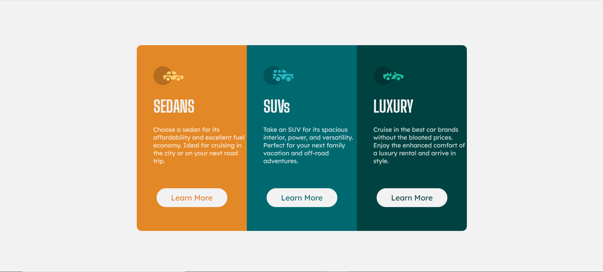
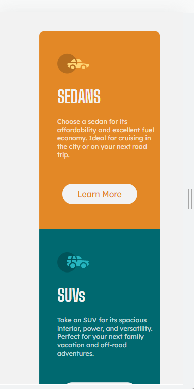
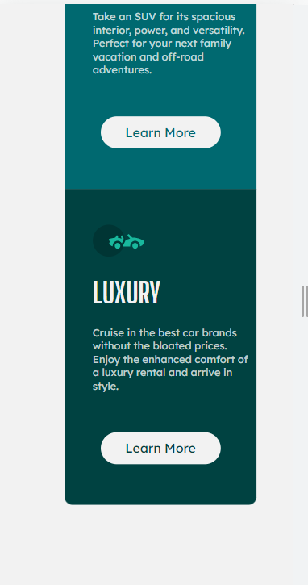

# Frontend Mentor - 3-column preview card component solution

This is a solution to the [3-column preview card component challenge on Frontend Mentor](https://www.frontendmentor.io/challenges/3column-preview-card-component-pH92eAR2-). Frontend Mentor challenges help you improve your coding skills by building realistic projects. 

## Table of contents

- [Overview](#overview)
  - [The challenge](#the-challenge)
  - [Screenshot](#screenshot)
  - [Links](#links)
- [My process](#my-process)
  - [Built with](#built-with)
  - [What I learned](#what-i-learned)
  - [Continued development](#continued-development)
  - [Useful resources](#useful-resources)
- [Author](#author)
- [Acknowledgments](#acknowledgments)


## Overview

### The challenge

Users should be able to:

- View the optimal layout depending on their device's screen size
- See hover states for interactive elements

### Screenshot






### Links

- Solution URL: [link to github solution](https://github.com/Priyanshi233/-3-column-preview-card-component-solution)
- Live Site URL: [link to live site URL](https://bright-lokum-8d9da7.netlify.app/)

## My process

### Built with

- Semantic HTML5 markup
- CSS custom properties
- Flexbox
- Mobile-first workflow
- [Styled Components](https://styled-components.com/) - For styles

### What I learned

I learned about overflow property in CSS which is very useful for the mobile application UI.

```css
 .flex-container {
      overflow: scroll;
    }
```

### Continued development

From this project, I think I still need to learn how to use semantic tags and relative units (rem, em, ...). And I need to work upon my CSS skills and upgrade it to the next level.

### Useful resources

- [Media screen property for more than one screen](https://www.w3schools.com/css/tryit.asp?filename=trycss_mediaqueries_flex) - This helped me in making the UI for mobile screen. I really liked this pattern and will use it going forward.

## Author

- Website - [Priyanshi Somani](https://github.com/Priyanshi233)
- Frontend Mentor - [@yourusername](https://www.frontendmentor.io/profile/Priyanshii677)

## Acknowledgments

Thank you to Google Search and the people mentioned in the Useful resource section.


